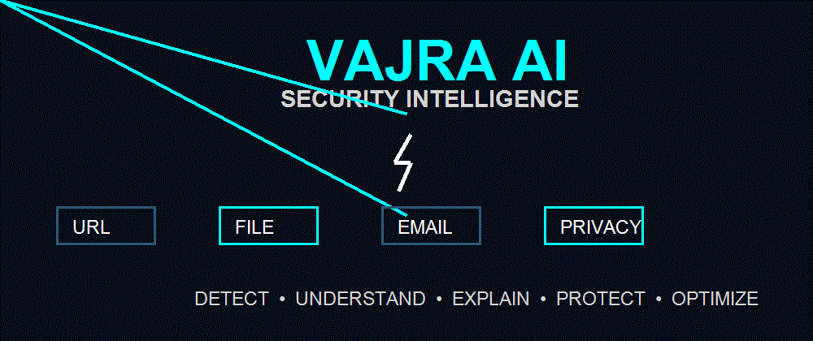
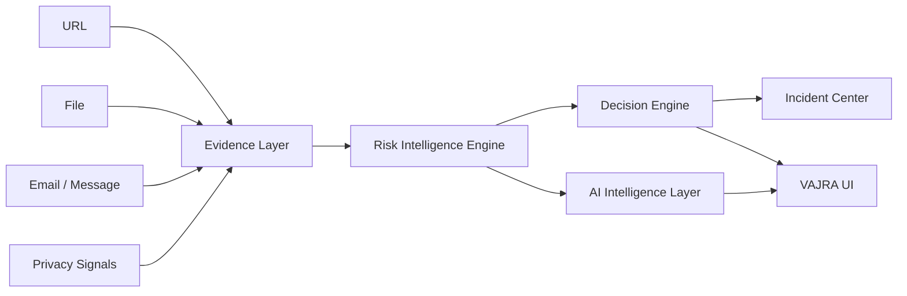
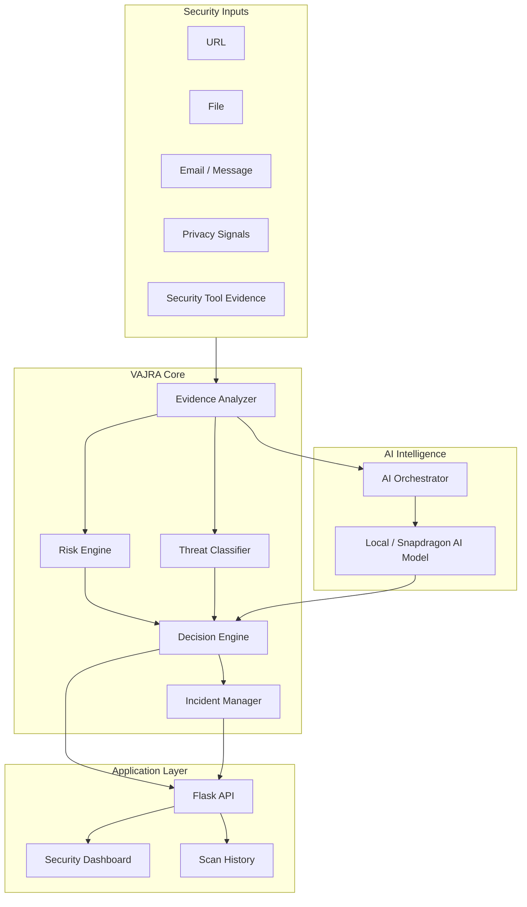

<div align="center">

# ⚡ VAJRA

### AI-Powered, Privacy-First Security Intelligence for Snapdragon PCs

**Detect → Understand → Explain → Protect → Optimize**



<br/>

[](https://www.python.org/)
[](https://flask.palletsprojects.com/)
[](#)
[](#)
[](#)

</div>

---

## 🛡️ What is VAJRA?

**VAJRA** is a security intelligence platform designed to turn scattered security signals into clear, explainable actions.

Instead of treating every alert independently, VAJRA combines evidence from multiple security surfaces and passes it through a common risk pipeline:

> **Evidence → Risk Intelligence → Decision → Incident → User Action**

VAJRA is designed for **Snapdragon-powered Windows PCs**, with a local-first architecture and a deployment path around **Qualcomm AI Hub / GenieX** for supported Snapdragon devices.

---

## ✨ Core Security Guardians

| Guardian | What it checks | Output |
|---|---|---|
| 🔗 **URL Guardian** | Domains, IP URLs, credential requests, encoded URLs, punycode, unusual ports | Risk score + decision |
| 📁 **File Guardian** | Executables, double extensions, suspicious names, archives, file metadata | File risk + evidence |
| 📧 **Email Guardian** | Phishing language, credential requests, financial pressure, suspicious links/attachments, impersonation | Allow / Review / Warn / Block |
| 🔐 **Privacy Guardian** | Sensitive locations, privacy-related signals and suspicious process indicators | Privacy risk assessment |
| 🧠 **Risk Intelligence** | Normalizes security signals across guardians | LOW / MEDIUM / HIGH / CRITICAL |
| 🚨 **Incident Center** | Stores and tracks security incidents | Open → Investigating → Resolved |
| 📊 **Scan History** | Keeps previous analysis results | Searchable security history |

---

## 🧠 How VAJRA Thinks



### Example

A suspicious message containing a credential request, financial pressure, and a suspicious link can produce a high combined risk instead of being treated as isolated text.

**Example result:**

`Risk Score 95 → CRITICAL → HIGH RISK → BLOCK`

---

## ⚙️ Architecture

VAJRA separates **evidence collection**, **security reasoning**, and **AI interpretation** so that the AI layer does not replace deterministic security checks.



---

## 🚀 Key Workflow

### 1. Detect
VAJRA receives a URL, file, message, privacy signal, or security evidence.

### 2. Understand
Security-specific analyzers extract meaningful indicators.

### 3. Explain
The platform converts raw signals into understandable risk information.

### 4. Protect
The decision layer produces an action such as:

- `ALLOW`
- `REVIEW`
- `WARN`
- `BLOCK`

### 5. Optimize
Results are recorded in incidents and scan history so the security workflow remains traceable.

---

## 🧪 Security Analysis Examples

### URL

```text
https://user@example.com:8080/login
```

Possible signals:

- Credential-style URL
- Username embedded in URL
- Unusual port

These signals are combined by the risk engine rather than treated independently.

### File

```text
invoice.pdf.exe
```

Possible signals:

- Executable extension
- Double extension
- Suspicious filename

The combined result can raise the file to a higher risk level.

### Email

A phishing-style message containing:

- urgent language
- credential request
- financial pressure
- suspicious link

can produce a combined high-risk decision.

---

## 🧩 Security Tools as Evidence

Where available, VAJRA can use security utilities as **evidence collectors** rather than allowing arbitrary command execution.

Examples include:

- Nmap
- YARA
- ClamAV
- tshark
- curl
- DNS / reverse-DNS analysis
- file hashing

The architecture is:

```text
Security Tool
     ↓
Evidence
     ↓
Normalization
     ↓
Risk Intelligence
     ↓
Decision
```

This keeps the tool layer separate from the decision layer.

---

## 🧠 AI + Snapdragon

VAJRA is designed with a **local-first AI deployment path**.

For supported Snapdragon Windows devices, the project is structured around the Qualcomm AI ecosystem and **GenieX / llama.cpp** execution.

```text
                    ┌───────────────────────┐
                    │   Qualcomm AI Hub     │
                    │ Model / Optimization   │
                    └───────────┬───────────┘
                                │
                                ▼
                    ┌───────────────────────┐
                    │       GenieX           │
                    │ Snapdragon Runtime     │
                    └───────────┬───────────┘
                                │
                                ▼
                    ┌───────────────────────┐
                    │     VAJRA AI Core     │
                    │ Explain • Analyze     │
                    └───────────┬───────────┘
                                │
                                ▼
                    ┌───────────────────────┐
                    │ Security Decision     │
                    └───────────────────────┘
```

> **Technical note:** the current development environment is used for the application and security-engineering layer. Actual Snapdragon NPU inference is intended for supported Snapdragon Windows hardware; the repository does not claim live NPU inference on a non-Snapdragon development PC.

---

## 🔒 Privacy-First by Design

VAJRA follows a privacy-conscious approach:

- Local-first processing where practical
- Security evidence separated from user-facing explanations
- No arbitrary shell execution from the dashboard
- Deterministic security checks remain available without AI
- Incident and scan records are structured for traceability
- Snapdragon deployment is designed around on-device AI execution where supported

---

## 🖥️ Application

The Flask-based dashboard provides API-driven access to:

```text
URL Analysis
File Analysis
Email Analysis
Privacy Analysis
AI Backend Status
Incident Management
Scan History
```

The project is structured so the security engines can be tested independently from the UI.

---

## 📁 Project Structure

```text
VAJRA/
├── app/
│   ├── core/          # Risk, threat, decision and incident intelligence
│   ├── models/        # AI and backend abstractions
│   ├── security/      # URL, file, email and privacy guardians
│   ├── tools/         # Security evidence collection
│   ├── web/           # Flask dashboard + API
│   └── main.py
├── data/              # Runtime security data
├── models/            # Local model assets
├── runtime/           # Optional runtime integrations
├── logs/              # Runtime logs
└── README.md
```

---

## 🎯 Why VAJRA?

VAJRA focuses on a simple idea:

> **Security should not just detect a threat. It should explain the evidence and turn it into an actionable decision.**

The platform combines:

**Multi-surface detection**  
→ **Evidence-driven analysis**  
→ **Risk intelligence**  
→ **Explainable decisions**  
→ **Incident tracking**  
→ **Snapdragon-ready AI architecture**

---

## 🛠️ Technology

| Layer | Technology |
|---|---|
| Language | Python |
| Web | Flask |
| Security | Custom analysis engines + optional security utilities |
| Data | SQLite / structured security records |
| AI | Local-first AI abstraction |
| Snapdragon Path | Qualcomm AI Hub / GenieX |
| Frontend | HTML / CSS / JavaScript |
| Testing | Python-based component and API verification |

---

## 📌 Project Status

**Competition build status: Ready**

Implemented application capabilities include:

- URL Guardian
- File Guardian
- Email & Message Guardian
- Privacy Guardian
- Risk Intelligence
- Decision Engine
- Incident Center
- Scan History
- AI backend abstraction
- Qualcomm / Snapdragon deployment integration path
- Flask security dashboard

---

<div align="center">

### ⚡ VAJRA

**Detect. Understand. Explain. Protect. Optimize.**

Built for the next generation of privacy-first endpoint security.

</div>
